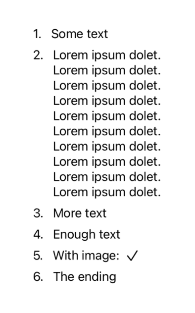

# SequenceBuilder

**SequenceBuilder** is a general purpose *Function Builder* / [*Result Builder*](https://github.com/apple/swift-evolution/blob/main/proposals/0289-result-builders.md)
for Swift. It allows you to build arbitrary heterogenous sequences without loosing information about the underlying types.

SequenceBuilder might be helpful for you if you have ever encountered the error message  `Protocol 'X' can only be used as a generic constraint because it has Self or associated type requirements`. For example:

```swift
protocol Key {
    associatedtype Value
}

struct Foo {
    let keys: [Key]
    // ❌ Protocol 'Key' can only be used as a generic constraint because it has Self or associated type requirements
}
```

With SequenceBuilder you can have sequences of types with associated type requirements.

```swift
import SequenceBuilder

struct Foo<S: Sequence> where S.Element: Key {
    let keys: S

    init(@SequenceBuilder builder: () -> S) {
        keys = builder()
    }
}
```

For this, you have to define how to handle heterogenous `Value`s by extending an `Either`-type:

```swift
extension Either: Key where Left: Key, Right: Key {
    typealias Value = Either<Left.Value, Right.Value>
}
```

Then you can use `Foo` like this:

```swift

struct StringKey: Key { typealias Value = String }
struct IntKey: Key { typealias Value = Int }

let foo = Foo {
    StringKey()
    IntKey()
}
```

## SwiftUI

This technique can be used for any kind of heterogenous sequence, but it is especially useful for building custom container views in **SwiftUI**.
For views, the `Either`-type is already extended.

You can use `@SequenceBuilder` like the `@ViewBuilder`-attribute in SwiftUI. As a result, you don't just get one view, but a sequence of individual views *without* resorting to `AnyView`.
SequenceBuilder has the same limitation as ViewBuilder in that it currently only supports 10 Elements without nesting.

For a simple example, this view wraps its child views in an enumeration similar to an ordered HTML list ([Full example](Sources/SequenceBuilderExamples/EnumerationView.swift)).
By constraining the sequence elements (`… where Content.Element: View`), we can store and iterate over the sequence for abritrary views.  
```swift
import SequenceBuilder
import SwiftUI

struct EnumerationView<Content: Sequence>: View where Content.Element: View {

    let content: Content

    init(@SequenceBuilder builder: () -> Content) {
        self.content = builder()
    }

    var body: some View {
        VStack(alignment: .leading, spacing: 8) {
            ForEach(sequence: content) { (index, content) in
                HStack(alignment: .top) {
                    Text("\(index + 1). ")
                    content
                }
            }
        }
    }
}

// Usage: 
EnumerationView {
    Text("Some text")
    VStack {
        ForEach(0..<10, id: \.self) { _ in
            Text("Lorem ipsum dolet.")
        }
    }
    if true {
        Text("More text")
        Text("Enough text")
    }
    HStack {
        Text("With image:")
        Image(systemName: "checkmark")
    }
    Text("The ending")
}
```



The elements of the heterogeneous sequence don't have to be views. For a more intricate example, where the SequenceBuilder is used to build
a table out of columns, see [`SwiftTableView`](https://github.com/andtie/SwiftTableView).

## What kind of sorcery is this?

You might ask yourself at this point how this is implemented and I encourage you to check out the source. It is very small.

The elements of the sequence are of type `Either`:
```swift
public enum Either<Left, Right> {
    case left(Left)
    case right(Right)
}
```
For every additional element in the sequence, another `Either` is nested inside the other ones. E.g.:
- the sequence `Text, Image` becomes `[Either<Text, Image>]`
- the sequence `Text, Image, Text` becomes `[Either<Text, Either<Image, Text>>]`
- the sequence `Text, Image, Text, Button` becomes `[Either<Text, Either<Image, Either<Text, Button>>>]`
- and so on ...

This growth of types is similar to the kind you get in SwiftUI. It seems to work fine, but it is probably not suitable for very large collections.  

If you just want a collection of views, yout don't have to care about this implementation detail, because `Either` conforms to `View` if `Left` and `Right` also conform to `View`.  
But if you want to use your own protocols with or without associated types, then you have to extend `Either` yourself.

## Installation

### Swift Package Manager

In Xcode, select menu `File > Swift Packages > Add Package Dependency...` and enter the repository URL.
```
Repository: "https://github.com/andtie/SequenceBuilder"
```
